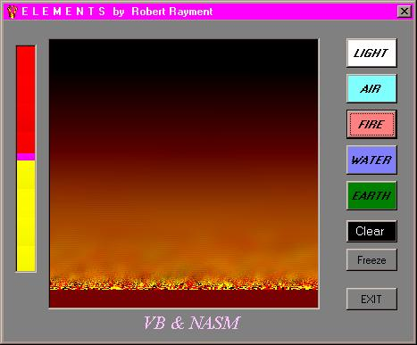

<div align="center">

## EarthWaterFireAirLight


</div>

### Description

Elemental NASM.(UPDATE Now works on Win2000 and Probably WinNT) The zip file is ~ 26KB
 
### More Info
 
Machine code & VB

Pictures


<span>             |<span>
---                |---
**Submitted On**   |2001-06-20 20:10:18
**By**             |[Robert Rayment](https://github.com/Planet-Source-Code/PSCIndex/blob/master/ByAuthor/robert-rayment.md)
**Level**          |Advanced
**User Rating**    |4.7 (42 globes from 9 users)
**Compatibility**  |VB 6\.0
**Category**       |[Graphics](https://github.com/Planet-Source-Code/PSCIndex/blob/master/ByCategory/graphics__1-46.md)
**World**          |[Visual Basic](https://github.com/Planet-Source-Code/PSCIndex/blob/master/ByWorld/visual-basic.md)
**Archive File**   |[EarthWater214446212001\.zip](https://github.com/Planet-Source-Code/robert-rayment-earthwaterfireairlight__1-13482/archive/master.zip)

### API Declarations

```
CallWindowsProc
GetObjectAPI
```


